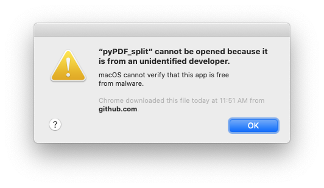
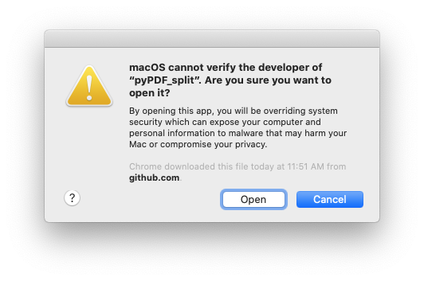

# pyPDF_split
Split PDFs with multiple student records into individual PDFs.

pyPDF_split searches a PDF for the string `StudentID:NNNNNNN` and splits the PDF into individual PDFs in a sub-folder with the StudentID embedded in the new file name.

pyPDF_split pairs nicely with the [insertFiles](https://github.com/txoof/insertFiles) and [create_folders](https://github.com/txoof/portfolioCreator) scripts.

Contact Information:
aaron.ciuffo@gmail.com


## Quick Start
**NOTE:** If this is the first time you've run this program, please see the [full instructions](#FullInstructions) below.
* [Download link](https://github.com/txoof/pyPDF_split/raw/master/pyPDF_split.tgz)

1. Launch the `py_pdfsplit` application from your `Applications` folder by double clicking on it.
2. When prompted, locate a PDF that needs to be split by clicking on the `Browse` button -- this will launch a Finder window allowing you find and choose a single PDF file
    
3. Click `Ok` when ready
4. pyPDF_split will split the PDF into a sub-folder within the same folder as the original pdf:
    
5. Split another PDF by clicking `Browse` or `Cancel` to quit

<a name='FullInstructions'></a>
## Full Instructions
1. Download the latest version of pyPDF_split [here](https://github.com/txoof/pyPDF_split/raw/master/pyPDF_split.tgz)
2. Locate the downloaded file in the Downloads folder
3. Double click on the `.tgz` file to decompress it
4. Move the `py_pdfsplit` file into your `Applications` folder
    * **NOTE:** if you simply double click on the application, you will likely see this warning:
    
    * Continue to step 5!
5. Locate the `py_pdfsplit` file in your `Applications` folder and right click (or Ctrl+click) and choose `Open`
    * You will see the following prompt:
    
    * Click `Open`
    * It may take several seconds, but the application and a terminal window will open.
2. When prompted, locate a PDF that needs to be split by clicking on the `Browse` button -- this will launch a Finder window allowing you find and choose a single PDF file
    
3. Click `Ok` when ready
4. pyPDF_split will split the PDF into a sub-folder within the same folder as the original pdf:
    
5. Split another PDF by clicking `Browse` or `Cancel` to quit

## Building pyPDF_Split
Build this script in a pyenv/pipenv with TK built in.
1. See [this Gist](https://gist.github.com/txoof/675e72d43f1bfbade04fdcec99ff4085) for complete instructions for setting up a working pyenv with TK, pipenv and Jupyter
2. Set up a Python 3+ jupyter kernel for further editing from within this repo directory:
```
$ pipenv --3 install ipykernel
$ projectName=$(basename `pipenv --venv`)
$ pipenv run python -m ipykernel install --user --name="${projectName}"
```
3. Make any edits needed and then rebuild the program with:
```
$ ./build.sh
```


```python
!jupyter-nbconvert --to markdown README.ipynb
```

    [NbConvertApp] Converting notebook README.ipynb to markdown
    [NbConvertApp] Writing 3158 bytes to README.md

